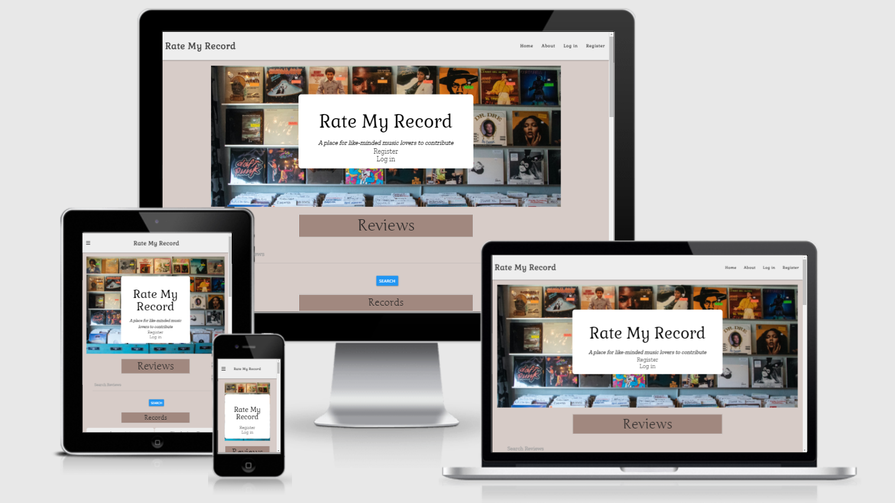
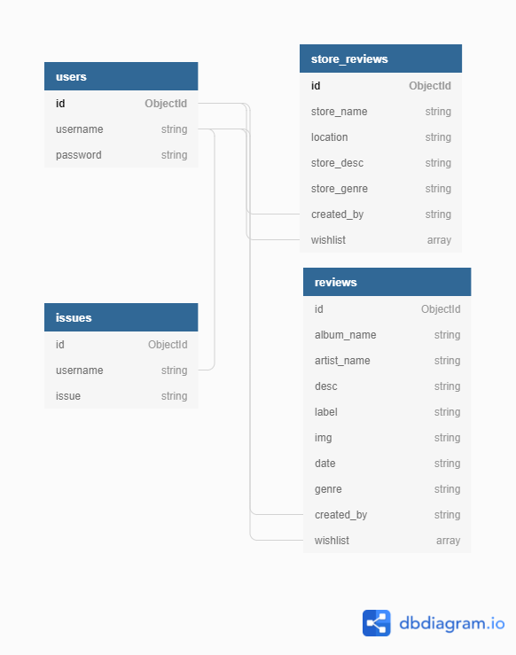

# Rate My Record

In line with the criteria for the third milestone project I have chosen to adopt the first route in developing my own idea and bringing it to life. The idea chosen meets all CRUD criteria in making the dynamic website function and allows visitors to sign up/sign in at any given point of their own choosing.
The idea is quite simple. The website is a review sharing site which allows users to comment on specific albums/records/singles as well as record stores themselves. On their own profile page, user’s can view the reviews they’ve made in the past as well as editing them. They can also add reviews from other users to their own page using the ‘add to wishlist’ button displayed on reviews made from others on the landing page. Going with these features is the ability a user has to remove their own review as well as those from their wish list. 
The purpose of the website is to give user’s the chance to acquire and learn about new music/record stores they would’ve been unfamiliar with. The database is utilised in such a way as to prompt users into discovering new things and potentially providing some knowledge of their own musical taste. 
Going forward with this project, I would ideally like to allow user’s to interact with one another and to facilitate an online marketplace for the buying and selling of vinyl records. 

Find the link to my site [here](https://dashboard.render.com/web/srv-cebkacirrk0bbtf3n0lg/deploys/dep-cebkaeirrk0bbtf3o0l0).

## User Stories 

- As a user I want to access a website that allows me to review a record and/or a record store.
- As a user I want to input my own reviews in a seamlessly easy fasion.
- As a user I want the site to make perfect sense upon my initial point of entry to it.
- As a user I want to be able to update my reviews on the website.
- As a user I want to be able to read other user's reviews.
- As a user I want to be able to search the website for any particular review of my choosing.
- As a user I want to be able to remove a review made by myself.
- As a user I want to have a neat, accessible and organised website that has a very clear outline from the moment I enter it.
- As a user I would like to be able to contact the site owner(s) over any issues/improvements that I see fit to further my experience on the website.
- As admin, I would like to mediate over all user's actions.
- As admin I would like to be able to communicate with user's and have their issues and improvement suggestions listened and seen to.
- As admin I want to ensure that user's are enjoying their experience as much as possible and ensure the website is as responsive to a mobile user as it is to a desktop user.
- As admin I want to ensure that all information supplied by the users is fair and just.

## UX/UI

### Scope

For this particularly project to flourish, it was vital that the correct steps and frameworks were utilised in order to provide the users a fluid manner in which to perform CRUD operations at will. 
The functional requirements utilised to achieve the project criteria were as follows:
- Materialise 
- Flask
- Python
- Flash 
- MongoDB

The features of the website were drafted up to suit the project criteria whilst also making sense for a potential user of the site itself. Being an online review page for music, I felt the following features were more than necessary for the website:

#### Current Features

- Landing page (with all reviews)
- Search bar (for all reviews)
- Log in page
- Register page
- About page
- Add a record review page
- Add a record store review page
- Edit a record review page
- Edit a record store review page
- Profile page (displays a user's reviews & wishlist)
- Delete button (for reviews)
- Add to wishlist button
- Remove from wishlist button
- Manage reviews page (for admin)
- Manage user's page (admin)
- Contact page
- Social links
- Site banner with core message

#### Features left to implement
- Direct Messaging: Allow user's to contact one another, which will promote the essence of the website in a more intimate matter as they discuss an album or store together.
- Marketplace: Eventually, I would like to push the website into the realm of e-commerce, allowing user's to advertise what they have got for sale and what they would like to purchase. Allowing them to search through the site will help users locate records they would like to buy and in tandem with direct messaging they will be able to set up a payment with the seller of said record.

### Structure

- The landing page (home page) will be home to every review made from all user's to the website. If it is a first time visitor to the site, the page will only work as to be read from. On the site banner above the image at the top of the page, the unregistered/not logged on user will have two links available to them. One for registering (which will bring a user to the registration page) and the other for loggin in. If the user is logged in then each review will have the following buttons below the review description: Add to wishlist (if the user didn't create the review), Edit & Delete (if they did create the review).

- The edit button will take the user to the edit review page/ edit store review page. Here they will be able to update all current information on the review to date.

- The delete button will permanently delete whatever review is chosen by the user. Admin has access to this button on every review on the site.

- The about page will give a brief background into what the website is all about. It will also have links for first time visitors to register or for current users to report something that is amiss.

- Log in/ Log out. In the navbar, these two options will be available to visitors to the website depending on whether they are currently logged in (log out displays) and vice-versa.

- The add a review link works as a dropdown and allows user's to decide on writing up a review on either a record or on a record store. 

- For the admin two additional pages will be available: Manage Reviews & Manage Users. Each page allows admin full control over the content of the site and who is able to contribute.

- Profile page has all of a user's reviews along with the reviews they have added to their own wishlist. The user can click into any review to view it and can remove any review from either their own review list or from their wishlist if they want.

- Each review will have it's own designated review page. This page provides full information on the review and if the user has created it they will have access to the edit and delete buttons.

I constructed a data schema using [dbdiagram.io](https://dbdiagram.io/home).
.

### Skeleton

The site was first sketched on paper with a pen by myself before I attempted to make a more concrete blueprint using [Balsamiq](https://balsamiq.com/).

The following links will take you to each set of wireframes associated with the corresponding screen size.
- [Phone](static/wireframes/phone)
- [Tablet](static/wireframes/tablet)
- [Desktop](static/wireframes/desktop)

### Surface

In order to mitigate the effects of colour overload, I kept this in mind whilst debating which colours to use for the website.

- Colours
For the main body of the site I decided to utilise a background color of '#d7ccc8' and for the font color of all elements in the body element I used the hex color of '#212121'. For all headings on the site I used the 'jungle' font-family along with a background colour of '#a1887f'. All in all, I felt the background colours worked to project the core colours of the body elements very well. When I look at the site (across all pages) I feel that all sections are distinct and visible and this is more or less down to the combination of colours I conciously decided on at the onset of the project. 

- Typography
The font-families that were utilised throughout the project were: 'Zilla & Slab', 'Gabriel' & 'Jungle'. I didn't want to choose anymore than three as I felt that would work to distract the overall experience for a visitor to the website. 

- Images
The images used for the cover of the landing page was obtained through [unsplash](https://unsplash.com/) as was the default image for the record  and store reviews.

## Testing

Full documentation of all manual and automated testing can be found [here](TESTING.md).

## Technologies used

### Languages

- Python 
- HTML5
- CSS3
- Javascript

### Frameworks, Libraries and Programs

- Materialise
- Google Fonts
- Font awesome
- Flask
- Git 
- Gitpod
- Github
- Balsamiq
- MongoDB
- Heroku
- RandomKeygen
- Jinja
- Werkzeug
- Am I responsive
- jQuery

## Deployment 

The deployment of the website was done so using three different work spaces, each with their own respective steps. Github, MongoDB and heroku combined all their necessary functions to enable the creation of the site. 

### Github

- Creation
I first created the repositary through logging into my Github account and:
- Clicking the 'new' green button.
- This then prompted me to another page with asked me to name my new repositary. Above this input there is a dropdown menu offering a selection of various templates to utilise with the repository. I chose the Code Institute template in order to faciliate all the shortcuts included within it to make my workflow as fast as possible.

- Cloning and Forking
In order to clone my repository, the user must visit my repository page.
- Cloning by command line: Click the button beside the green button titled 'code', there you will be given various options on how you would like to clone the repository. You must then type 'git clone' into your own workspace along with the repo URL and enter.
- Forking: Go to my repositary [page](https://github.com/stuartj073/rate-my-record). In the top right of the page, below the navbar, click the 'fork' button. The fork should now be in your repositories.

### MongoDB

#### Site configuration

- Once you're registered, create and name a cluster.
- Set up a username and password in Database Access. Make sure to select the 'read and write to any database' option.
- Go back to the menu section and select Network Access. Add an IP address and select access from anywhere.
- Next step is to create a database. Do so by clicking 'collections'. The 'create database' button should be visible under the headings. Set up the name of the database and add any collections using the '+' button seen beside the database title.
- To add a document to any collection simply click the 'insert document' button in the top right hand side of the form.

#### Github configuration

- Create an env.py file with the following connections. ENSURE THIS FILE IS ADDED TO THE .GITIGNORE FILE.
- To install any requirements as needed, use the terminal and prefix any requirement with 'pip3'.

#### Connecting to MongoDB

- On the top right of the cluster page, click the connect button.
- Select 'connect your application' and then 'python' for the driver and whatever version of python that applies to you.
- You will then be given a connection string. Copy and paste this string into the MONGO_URI value in the env.py file. Change the placeholder database name to the database of which you are using.

### Heroku 

- Once logged in to Heroku click 'New' and then 'Create New app'. Click 'settings' and 'reveal config vars'. 
- Here you must put in all the key-value pairs as written down from the env.py file. Update any missing values with the new information you now have. 
- Now click 'Deploy'. 
- You are given three options in which to deploy the site. In my case I used Github, which allows you to manually search for your own Github repository. 
- Click 'enable automatic deployment' and your website should now be ready to go.

## Credits

### Content

- [Unsplash](https://unsplash.com/) was used for the cover image along with the default imaging for each store and record review. 
- [AmiResponsive](http://ami.responsivedesign.is/#) for the cover of the README file showing the website on four different screen resolutions.
- [Balsamiq](https://balsamiq.com/) for the blueprints needed to create the initial wireframes of the website on different screen resolutions at the project conception.
- [FontAwesome](https://fontawesome.com/) for the different logos utilised throughout the site as well as the social links for the site footer.
- [Dbdiagram.io](https://dbdiagram.io/home) for the visual representation of my data schema.
- [W3C](https://validator.w3.org/) to ensure all CSS and HTML code was bug free.

#### Review Content

The review content was largely just grabbed from [wikipedia](https://www.wikipedia.org/) pages along with some interviews from the [Guardian](https://www.theguardian.com/international) and [Fact](https://www.factmag.com/). In doing so it allowed me to work on the more fundamental aspects of the project whilst saving time having to write up many fictional reviews.

In the meantime, I have sent the site URL to more friends and family, which I hope will start to share and find music with many others online.

### Acknowledgements
I'd like to place on record my sincere thanks to my mentor Cans Succulu. Cans was always on hand for any issue I had with the project and I am very grateful for his efforts and insight into how I could improve the overall functioning and look of the game. 

I'd also like to thank the wider Code Institute community through the slack channel for any queries I had throughout my time on the project.

