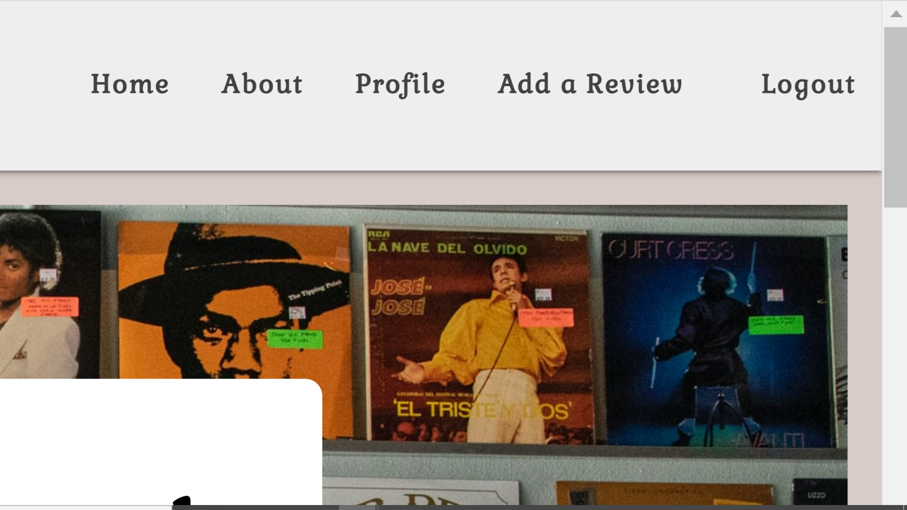
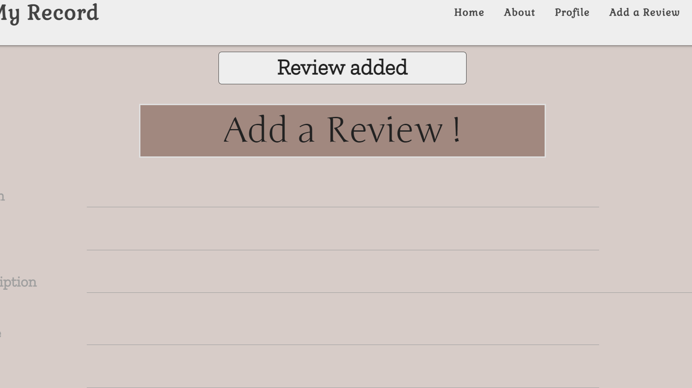
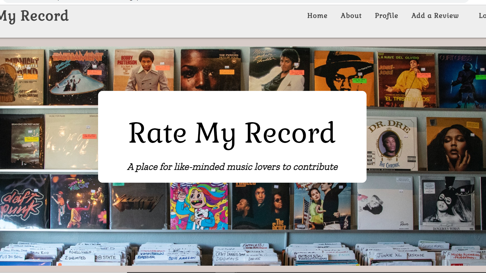
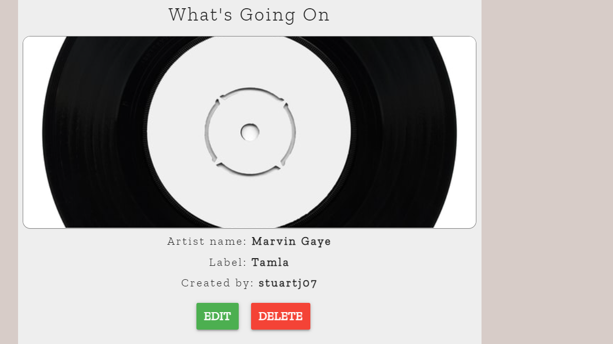
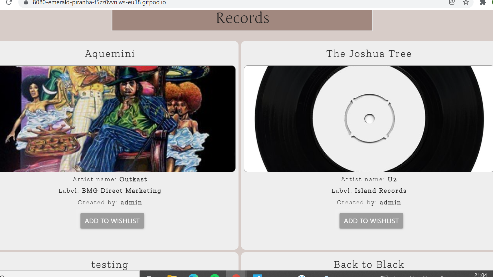
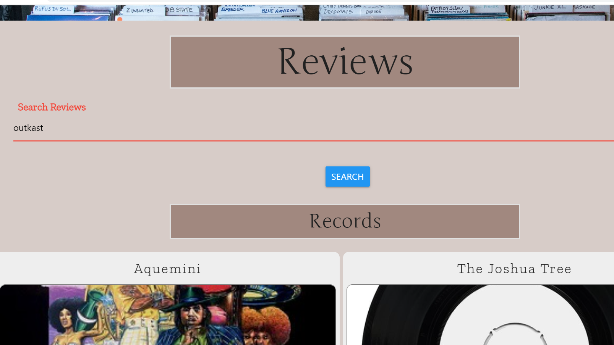
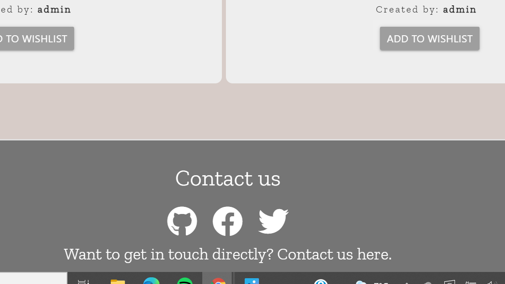
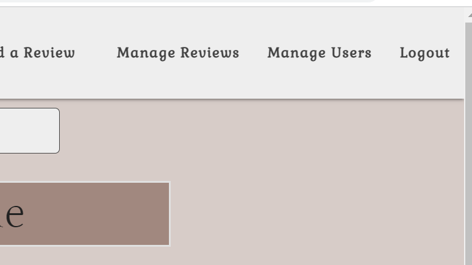
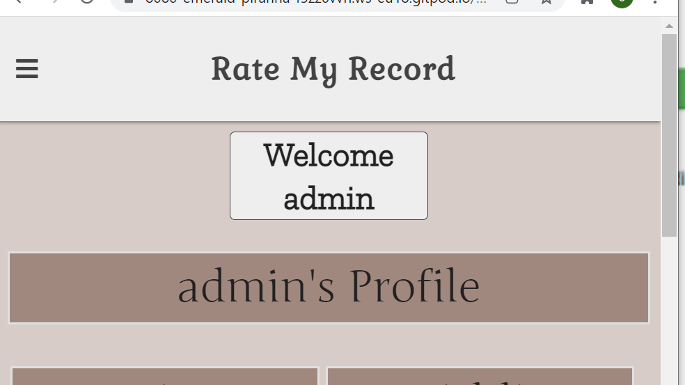
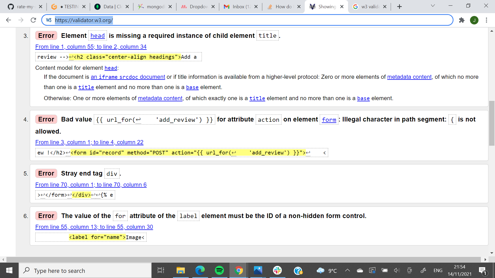

# Testing 
## Testing User Stories

- As a user I want to access a website that allows me to review a record and/or a record store. 
The fundamental aspect of the website. To facilitate user's ability to review records they could do so by clicking on the 'Add a review' button on the top right hand side of the navbar menu. They could then choose to either rate a record or rate a store. 

- As a user I want to input my own reviews in a seamlessly easy fasion.
When a user has located to either of these pages and has inputed information for the artifact in question a flash message will display the successful upload of said review.

- As a user I want the site to make sense upon my initial point of entry to it.
My aim from the layout I put forward for the landing page was to capture the essence of the site in as seamless a manner possible. I feel the combination of the cover image, along with the slogan as well as the reviews just underneath work to bring the ethos of the website almost immediately to potential users.

- As a user I want to be able to update my reviews on the website.
The user can achieve this by clicking on the 'edit' button which is located on any review of which they have created themselves.

- As a user I want to be able to read other user's reviews.
All reviews made by all users are located for viewing on the landing page.

- As a user I want to be able to search the website for any particular review of my choosing.
A search bar is located just underneath the cover image to the site

- As a user I want to be able to remove a review made by myself.
A delete button is available for all reviews made by the user in question.

- As a user I would like to be able to contact the site owner(s) over any issues/improvements that I see fit to further my experience on the website.
At the bottom of the page, a logged in user may access the 'contact' page where they can voice their opinion to the admin of the site.

- As admin, I would like to mediate over all user's actions.
If the user is admin they will have access to two extra pages which facilitate content moderation and who can contribute to it. 

- As admin I want to ensure that user's are enjoying their experience as much as possible and ensure the website is as responsive to a mobile user as it is to a desktop user.
Ensuring a site is responsive is tantamount to maximising user experience on the website. I ensured that users of all screensizes would have have access to the full experience of RateMyRecord.

## Manually Testing

### Chrome Developer Tools

A integral part of any developing projects I work on now. Using the chrome developer tools allowed me to continuosly check on how page rendered on various different screen sizes. Not only did it provided this for me but it also provides a vital edit function which allowed me to integrate different css properties to different tag, class and id elements. The developer tools were vital for the production on this project and If I didn't have access to them I am entirely sure the production process wouldn't have been as smooth or quick.

Another key aspect of my manually testing was in relation to jinja templating and ensuring that it was at all times working for me. At times, my syntax and file referencing to mongodb was not correct. A key way in which I was inspecting the correct rendering of the jinja templating was to include some test writing wrapped in either 'p' or 'h1' tags. I would place a small bit of text within a jinja for loop/if-else statement and if the code was rendered back to the site page I would know that my for/if-else statements were being written down correctly. I would also test out whether the variables I was stating in the functions were being referenced to correctly. I would place a certain variable into the main section of any html page (using double curly brackets) and if it was printed back on the main site I would be ensured that my variable referencing was being correctly implemented.

In addition to these testing procedures, I used console log feature to ensure all javascript code was being implemented correctly.

## Automated Testing

### HTML

Using the (w3 validator), I was able to located few issues within some of my html code.

- Add_review page
The review page showed the following errors from which I was able to sort out after noting. I left an extra div tag at the end of the html which was then removed. I also forgot to match the id of the image input with the 'for' attribute of the label

