# Testing 
## Testing User Stories

- As a user I want to access a website that allows me to review a record and/or a record store. 
The fundamental aspect of the website. To facilitate user's ability to review records they could do so by clicking on the 'Add a review' button on the top right hand side of the navbar menu. They could then choose to either rate a record or rate a store. 

- As a user I want to input my own reviews in a seamlessly easy fasion.
When a user has located to either of these pages and has inputed information for the artifact in question a flash message will display the successful upload of said review.

- As a user I want the site to make sense upon my initial point of entry to it.
My aim from the layout I put forward for the landing page was to capture the essence of the site in as seamless a manner possible. I feel the combination of the cover image, along with the slogan as well as the reviews just underneath work to bring the ethos of the website almost immediately to potential users.

- As a user I want to be able to update my reviews on the website.
The user can achieve this by clicking on the 'edit' button which is located on any review of which they have created themselves.

- As a user I want to be able to read other user's reviews.
All reviews made by all users are located for viewing on the landing page.

- As a user I want to be able to search the website for any particular review of my choosing.
A search bar is located just underneath the cover image to the site

- As a user I want to be able to remove a review made by myself.
A delete button is available for all reviews made by the user in question.

- As a user I would like to be able to contact the site owner(s) over any issues/improvements that I see fit to further my experience on the website.
At the bottom of the page, a logged in user may access the 'contact' page where they can voice their opinion to the admin of the site.

- As admin, I would like to mediate over all user's actions.
If the user is admin they will have access to two extra pages which facilitate content moderation and who can contribute to it. 

- As admin I want to ensure that user's are enjoying their experience as much as possible and ensure the website is as responsive to a mobile user as it is to a desktop user.
Ensuring a site is responsive is tantamount to maximising user experience on the website. I ensured that users of all screensizes would have have access to the full experience of RateMyRecord.

## Manually Testing

### Chrome Developer Tools

A integral part of any developing projects I work on now. Using the chrome developer tools allowed me to continuosly check on how page rendered on various different screen sizes. Not only did it provided this for me but it also provides a vital edit function which allowed me to integrate different css properties to different tag, class and id elements. The developer tools were vital for the production on this project and If I didn't have access to them I am entirely sure the production process wouldn't have been as smooth or quick.

Another key aspect of my manually testing was in relation to jinja templating and ensuring that it was at all times working for me. At times, my syntax and file referencing to mongodb was not correct. A key way in which I was inspecting the correct rendering of the jinja templating was to include some test writing wrapped in either 'p' or 'h1' tags. I would place a small bit of text within a jinja for loop/if-else statement and if the code was rendered back to the site page I would know that my for/if-else statements were being written down correctly. I would also test out whether the variables I was stating in the functions were being referenced to correctly. I would place a certain variable into the main section of any html page (using double curly brackets) and if it was printed back on the main site I would be ensured that my variable referencing was being correctly implemented.

In addition to these testing procedures, I used console log feature to ensure all javascript code was being implemented correctly.

## Automated Testing

### HTML

Using the (w3 validator), I was able to located few issues within some of my html code.

#### Heading issue
Throughout every page the same error was being displayed which was in relation to the lack of a heading for the flash section. After some time looking into the issue online through various resources It was discovered that it was a 'non-normative usage recommendation' as per the specifications of HTML5. I chose to ignore the issue as it was simply noted as a usage recommendation rather than something impending the overall functioning of the code itself.

- Landing page 
There were a few issues with the landing page. The main issues, which were centered around the attributes for the 'img' tag were sorted by removing the pixels ending to the height and width of the element. I also forgot to include the 'alt' tag to the element. This removed many of the errors that were being disovered in the html validator. I also was given an error for the 'h1' element being used elsewher throughout the document. It is considered bad practice to use the top level heading further down a page.

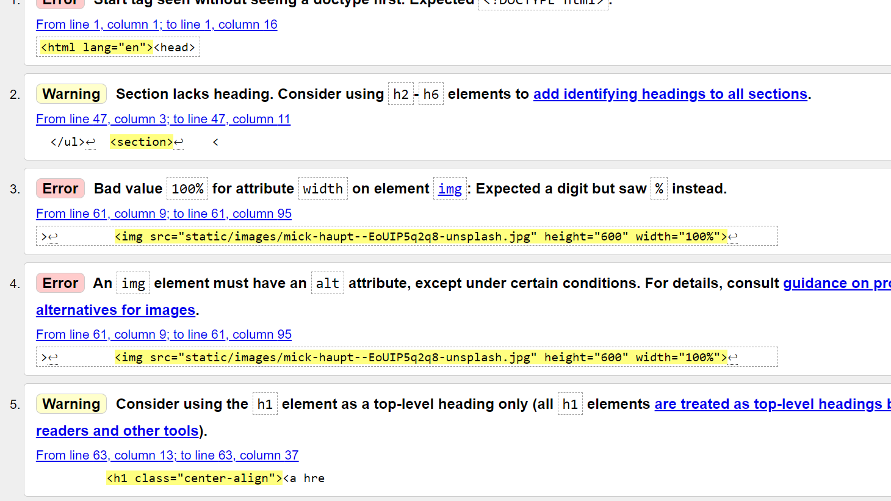

- About page
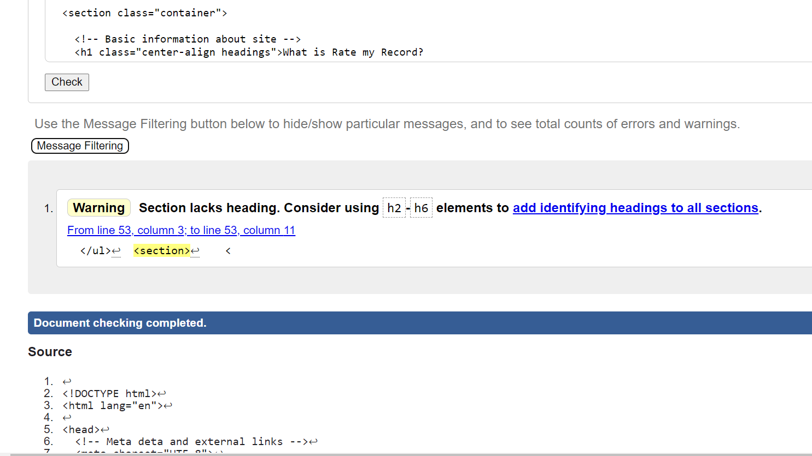

- Log in page
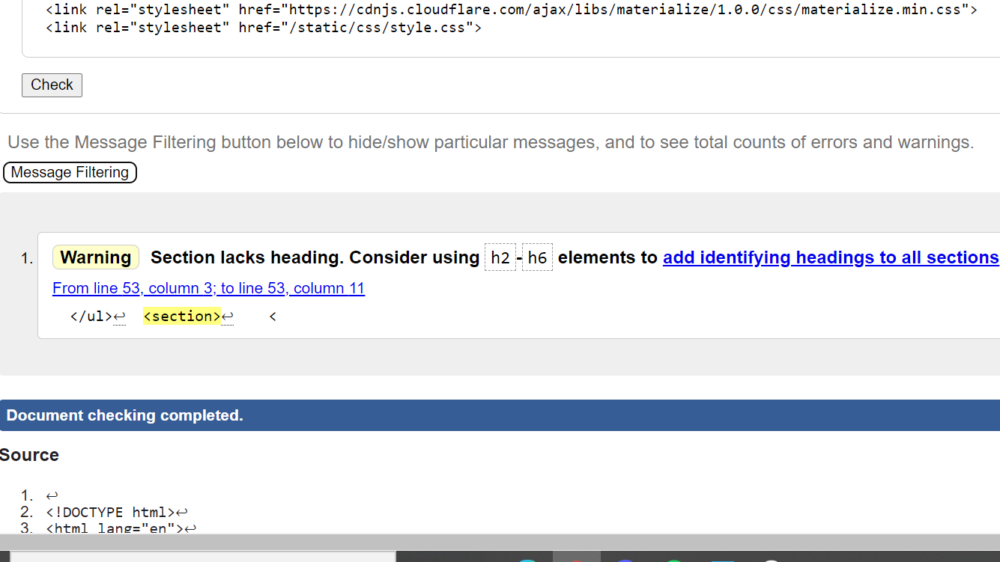

- Register page
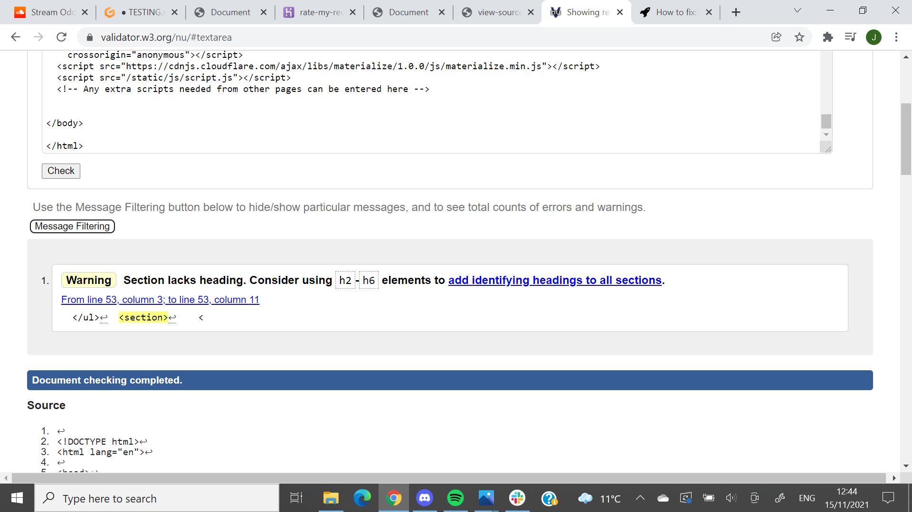

- Profile page
For the profile page I made the mistake of leaving out the alt attribute for both the default images for each reviews. The issue repeated itself a numeber of times due to the jinja for loop in the html code.This issue was fixed when I included the alt tags with some text.

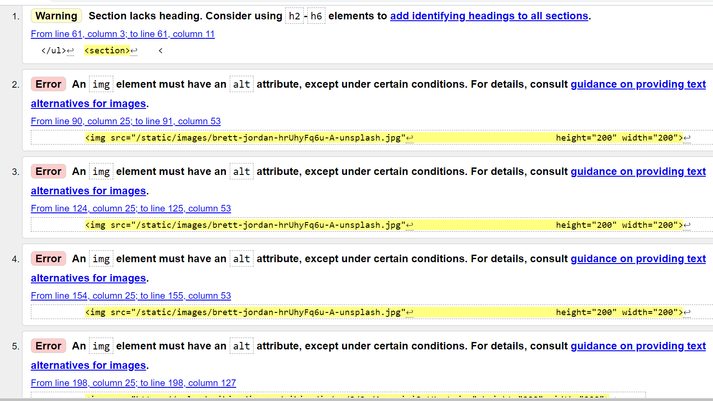

- Add a review page
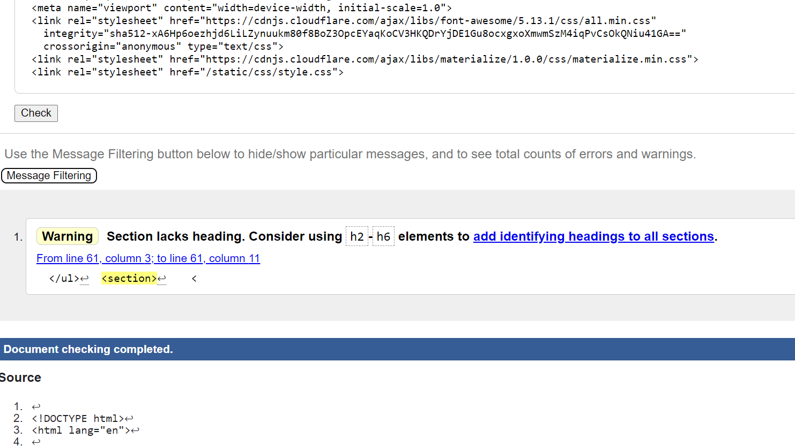

- Add a store review
The following error was noted from the store reviews html code. It was fixed by leaving a space between the two attributes in question

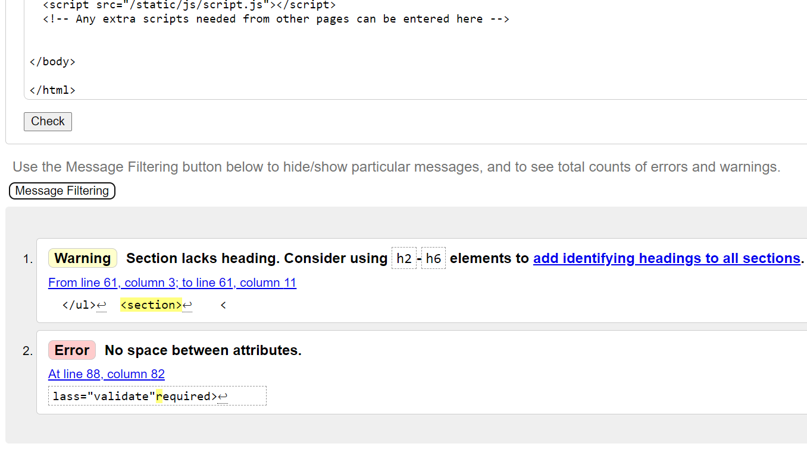

- Manage Reviews page
The following errors were found from the page. The 'px' issue again was replicated a number of times due to the jinja for loop. This was taken care of by removing the px at the end of the height and width attributes. 

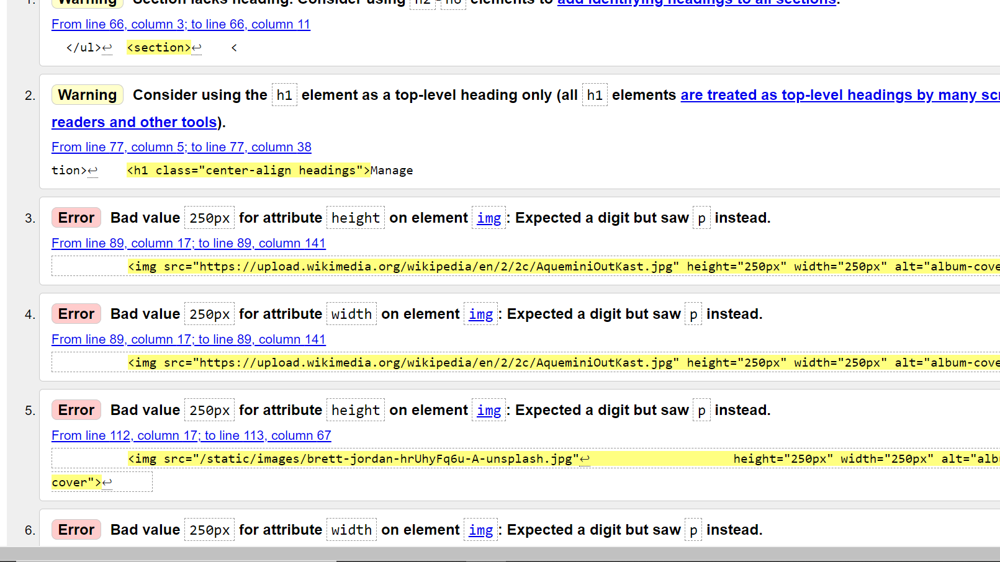

- Manage users
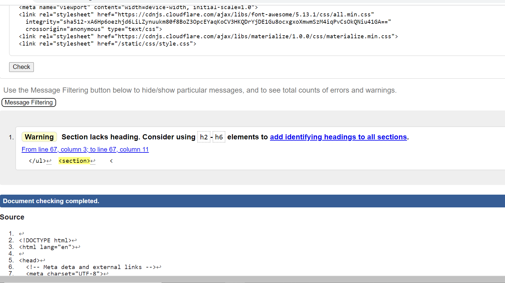

- Contact page
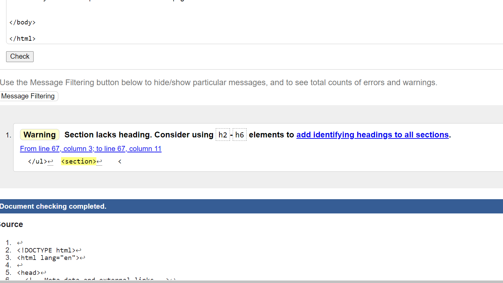

### CSS

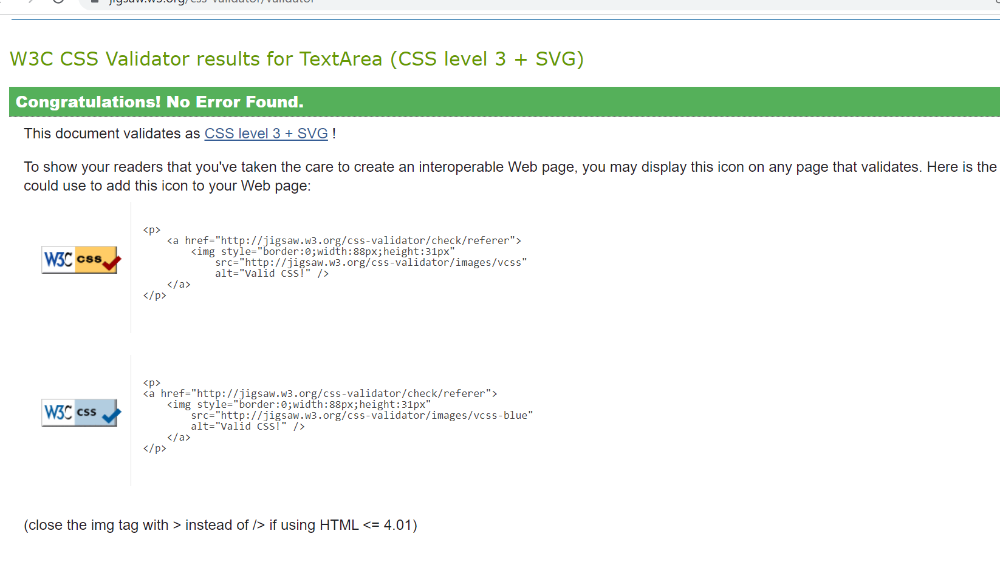

## Manual Testing

I used chrome developer tools extensively throughout my entire production process. This was done with the purpose of ensuring maximum responsiveness across all screen sizes and also by using the console log to ensure all javascript code was working. 

The page was tested on all screen sizes as shown in the 'Dimensions' scrollbar at the top of the developer tab. All screen sizes were evaluated and deemed fit for purpose for all different screen size users. In tandem with this, I sent out the website URL to various friends and family who came back to me with various different observations and recommendations to improve the overall user experience of the website.

I also made use of the jinja templating to print out variables to the different html pages from the app route. If the variable in question was not printing out I would then look into how my variable was being defined and would change it until it would eventually print out to the screen. This process allowed me to improve at location variables from mongodb.

# Bugs

## Brand Logo

For the brand logo of the site (located in the navbar) I wanted to ensure it had different font-sizes to account for the different screen sizes. When the site is rendered at 500px, ideally I would like the font-size to decrease to 1.5rem px. Unfortunately, whenever I put this style rule in (under the max-width:500px styles) it would ignore the font style rules I would have for the smaller screen sizes. I looked up the issue on various different platforms and asked friends and colleagues to no avail. The result is that when the screen is decreased to 500px, the font size is rendered a lot smaller than I would ideally have it. This smaller font size however, accounts for the much smaller screen resolutions of other potential visitors to the site.

## Image link

I am aware that it is possible to input incorrect links into the image input for the record and store review links.
Unfortunately, with the impending deadline and my current work routine I was unable to construct a function that correctly detects whether or not the link provided is in fact an image or not. As I get more spare time over the next few weeks I will be looking into devising a function that detects just that as I continue to learn on my path to finishing off the course to the best of my ability.
